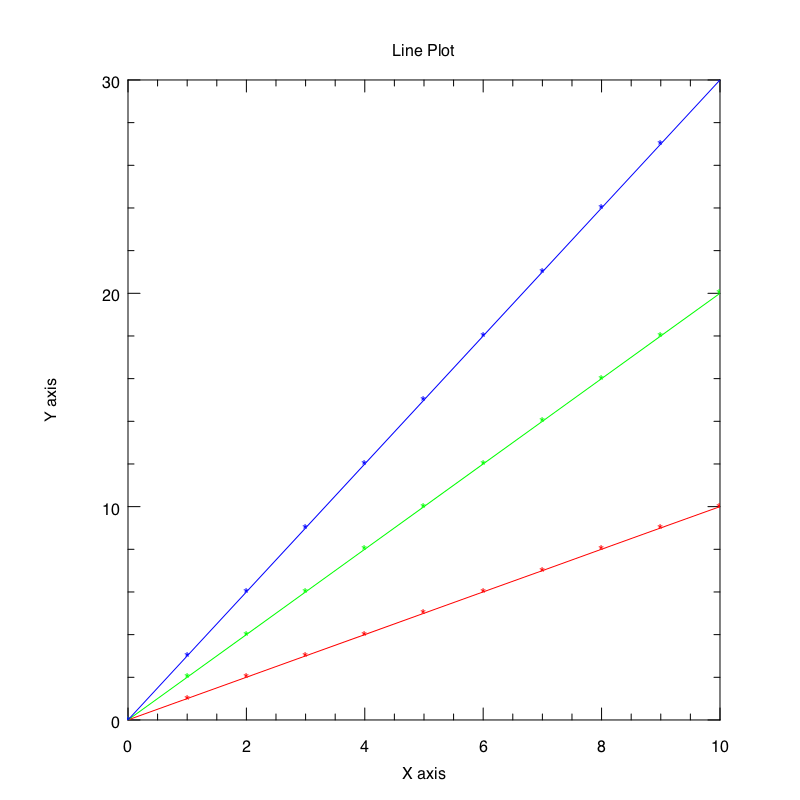
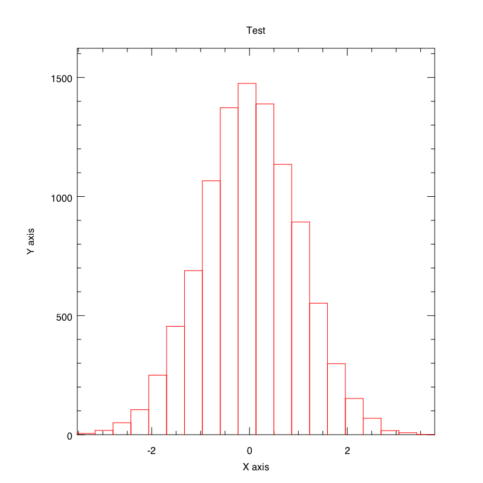
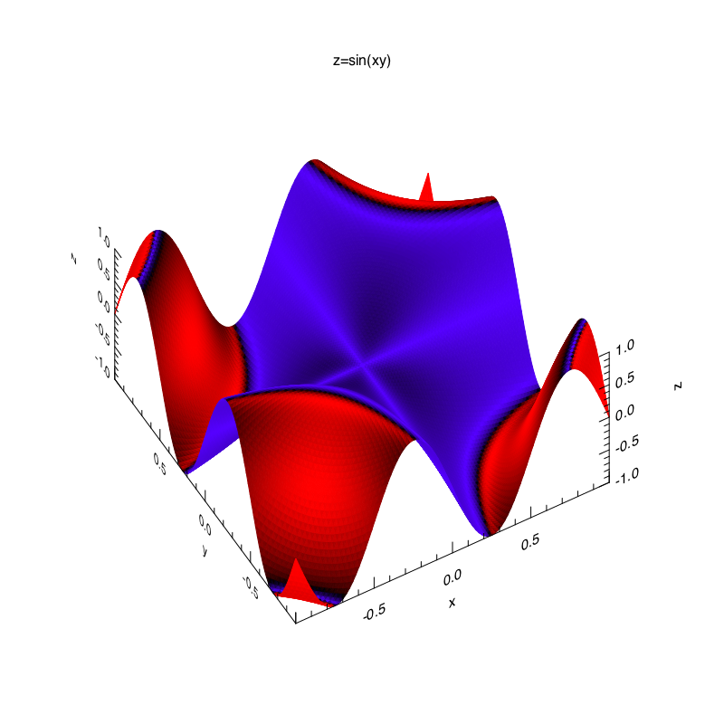

plplot-ffi
==========

LuaJIT wrapper for [PLplot](http://plplot.sourceforge.net/)

## Installation

This package requires PLplot to be installed in your system. You can download it from the project [website](http://plplot.sourceforge.net/), and also install it using brew in OS X:

```
brew install plplot
```

or apt in Ubuntu:

```
apt-get install libplplot12 plplot12-driver-cairo
```

The PLplot functions will draw the plots into cairo surfaces. The [torch-oocairo](https://github.com/akfidjeland/torch-oocairo) provides Lua bindings for Torch.


## C API

The first thing to do in order to access the PLplot C API is requiring the `plplot.api` Lua package:

```lua
local pl = require 'plplot.api'
```

Then the namespace `pl` will contain the functions in the PLplot C API. The functions in this API are usually prefixed by `pl`, for example `plinit` will now be accesible via `pl.init`, `plenv` via `pl.env` and so on. The only exception is `plend`, accesible via `pl.plend`.

## High level interface

This package tries to provide a similar interface to that in [torch/gnuplot](http://github.com/torch/gnuplot). In the following examples, `cairoContext` will always be a structure obtained by calling to the function `context_create` in [torch-oocairo](https://github.com/akfidjeland/torch-oocairo).

### Line plots

```lua
local plplot = require 'plplot'

...

local x = torch.DoubleTensor{0,1,2,3,4,5,6,7,8,9,10}
local plots = {}
for i = 1,3 do
    plots[i] = {x, torch.mul(x,i), '*-'}
end

plplot.init(cairoContext, 800, 800)
plplot.plot(plots)
plplot.labels('Line Plot', 'X axis', 'Y axis')
plplot.close()
```




The third element in the table defining each plots defines the format of that plot:

- `'|'` for using boxes.

- `'-'` for using lines.

- Any other character will be printed in all the points of the plot. This behaviour can be combined 
  with lines. For example, `'-*'` will print characters `*` separated by lines. 

If only one tensor is defined, then x values {0,1,2...} will be assumed.


### Histograms

```lua
local plplot = require 'plplot'

...

plplot.init(cairoContext, 800, 800)
plplot.hist(torch.randn(10000), 20)
plplot.labels('Histogram', 'X axis', 'Y axis')
plplot.close()
```




### Surfaces

```lua
local plplot = require 'plplot'

...

x = torch.linspace(-1,1)
z = torch.sin(torch.zeros(x:size(1),x:size(1)):addr(x,x)*math.pi*2)

plplot.init(cairoContext, WIDTH, HEIGTH)
plplot.splot({x,x,z})
plplot.labels3d('x', 'y', 'z')
plplot.title('z=sin(xy)')
plplot.close()
```



If only one tensor is defined, then x and y values {0,1,2...} will be assumed.


### Labels

There are three functions to add labels to the plot:

* `plplot.title(title)`: Adds a title.

* `plplot.labels(title, xlabel, ylabel)`: Adds a title and labels for the two axis in a 2D plot.

* `plplot.3dlabels(xlabel, ylabel, zlabel)`: Adds labels for all the axis in a 3D plot.


### Colors

The function `plplot.colors(axisColor, color)` changes the colors used for the plot. The colors are represented
by tables with three numbers from 0 to 255 corresponding to the RGB components. The parameter `axisColor` determines
the color that the library will use to print the axis and the labels. The second parameter is a list of colors that
will be used in the same order to show the plots.
